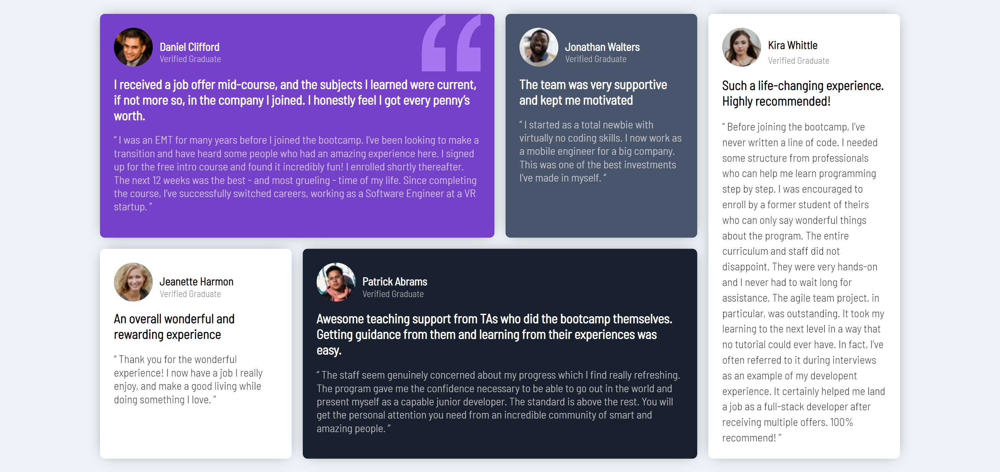
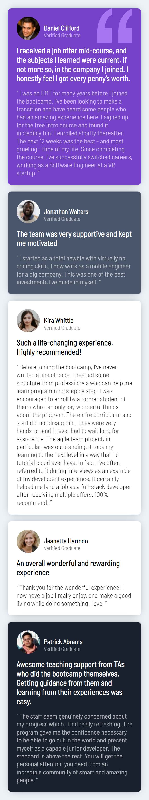

# Frontend Mentor - Testimonials grid section solution

This is a solution to the [Testimonials grid section challenge on Frontend Mentor](https://www.frontendmentor.io/challenges/testimonials-grid-section-Nnw6J7Un7). Frontend Mentor challenges help you improve your coding skills by building realistic projects. 

## Table of contents

- [Overview](#overview)
  - [Screenshot](#screenshot)
  - [Links](#links)
- [My process](#my-process)
  - [Built with](#built-with)
  - [What I learned](#what-i-learned)
- [Author](#author)

## Overview

 Hello..👋,
 Thanks for viewing my project.

### Screenshot
 
🖥 Desktop view.

📱 Mobile View.
 

### Links

- Live Site URL: [Testimonials Grid Section](https://piyushjain01.github.io/Testimonials_grid_section/)

## My process

### Built with

- Semantic HTML5 markup
- CSS custom properties
- Used Grid for layout design.
- Used Media queries to set layout in diffrent screens.

### What I learned

- Used Grid for the first time.
- Nice Project to practice grid.

## Author

- Frontend Mentor - [@piyushjain2211](https://www.frontendmentor.io/profile/piyushjain2211)
